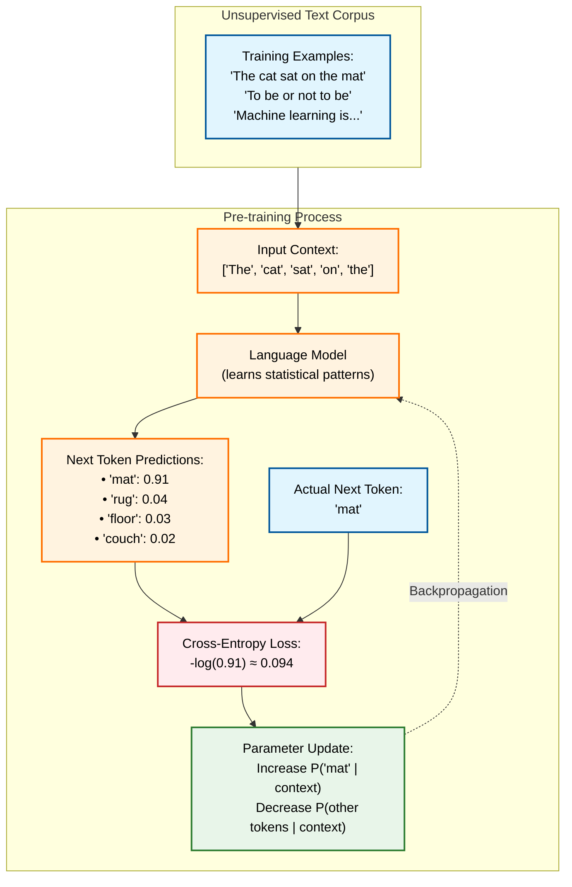
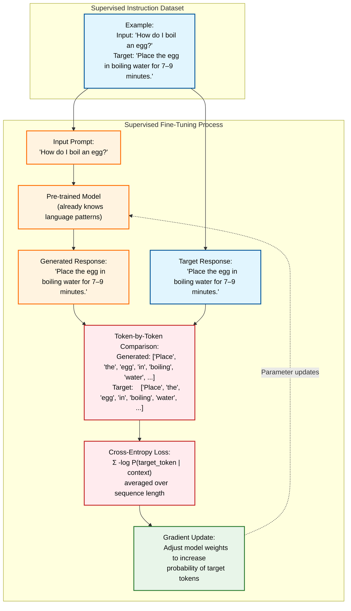
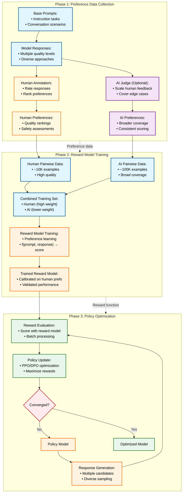
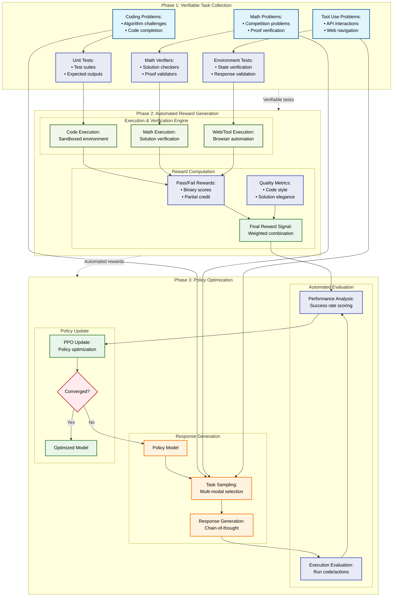

I had intended to start this post by proclaiming _"2026 will be the year of reinforcement learning"_ as 2025 is "the year of agents"... But model and research releases over the past several weeks indicate that it might be "H2 2025" is when reinforcement learning for agentic AI really takes off. Open model releases such as Qwen3 (particularly the recent Qwen3 0725 updates), Kimi K2, GLM-4.5, gold-level performance from OpenAI and Google at the International Math Olympiad, and a rapid increase in reinforcement learning algorithm research and refinement indicate that focus of the industry has shifted from scaling raw data and compute to reinforcement learning (RL).

## What is reinforcement learning?

Reinforcement learning (RL) is a process that allows an algorithm to continue learning _without explicit examples_. Whereas supervised learning tasks (such as classification or prediction) requires sets of input-output pairs that teach the model to generate the output based on the input, RL teaches the model to maximize the reward it receives for actions it takes in response to arbitrary inputs. Thus, RL requires a separate reward function or reward model that can determine the appropriate reward (and reward intensity) for any action the model may take.[^wiki]

## Language Model Training

Language models leverage both supervised and reinforcement learning approaches at different points during their training phase.

### Pre-training

A base model is trained on enormous amounts of text using a self-supervised approach. The process is self-supervised because the text corpus itself provides the training examples and the ground truth answer. During pre-training, the model tries to predict the next ~~word~~ token in a sentence or paragraph ("The cat in \_\_\_", "The cat in the \_\_\_", "The cat in the hat \_\_\_"). It does so by predicting the probability of _all_ tokens, and then receives feedback about the correct answer, allowing it to update its internal weights to make the correct answer more probable.

By the end of pre-training, the model has internalized how language "works". It is capable of continuing an initial "seed" phrase with fluent grammar and logical and syntactic consistency at the sentence and paragraph level. Because the training data encompassed broad, undirected swaths of text-encoded human knowledge, the model is familiar with general facts about the world that are consistent across its training data. Depending on the data mixture used in pre-training, the model may also exhibit some initial ability to follow instructions or continue patterns.

{}

{}

### Mid-training

Mid-training may involve _context extension_, _language extension_, and/or _domain extension_, enabling the pre-trained model to be able to comprehend and work with longer contexts, to understand and reply in different languages, and/or to integrate _knowledge_ from high-quality datasets rather than simply produce coherent output, respectively. Mid-training is also likely to include instruction-following training. The idea is to refine the model's predictions by showing it many examples of how we want it to respond. Depending on the subtype of training during the mid-training phase, the model may get feedback after each token is predicted (i.e., the same next-token prediction task used in pre-training), or it may get feedback only after it generates a complete response (which is more typical of supervised fine-tuning).

{}

{}

The distinction between pre-training, mid-training, and post-training is fuzzy; I listened to a podcast where the definition of mid-training was "not pre-training and not post-training" (_A/N: sorry, I can't find the reference_). I think of mid-training as "adding utility" but not the final polish; capabilities introduced in mid-training, such as instruction-following and long-context understanding, are often required in post-training.

### Post-training

Post-training focuses the model on being able to complete tasks in alignment with human expectations. Various reinforcement learning (RL) techniques are used (RLHF - RL with Human Feedback, RLVR - RL with Verifiable Rewards) that assess the full model response rather than simply determining whether the next-token-prediction is correct. _Post-training focuses on assessing the full model response in its entirety; pre- and mid-training focus on next-token accuracy._

#### RLHF

> We first collect a dataset of human-written demonstrations on prompts submitted to our API, and use this to train our supervised learning baselines. Next, we collect a dataset of human-labeled comparisons between two model outputs on a larger set of API prompts. We then train a reward model (RM) on this dataset to predict which output our labelers would prefer. Finally, we use this RM as a reward function and fine-tune our GPT‑3 policy to maximize this reward using the PPO algorithm⁠.
> [Aligning language models to follow instructions | OpenAI](https://openai.com/index/instruction-following/) 27 Jan 2022

#### RL (RLVR)

[^wiki]: [Reinforcement learning](https://en.wikipedia.org/wiki/Reinforcement_learning)
