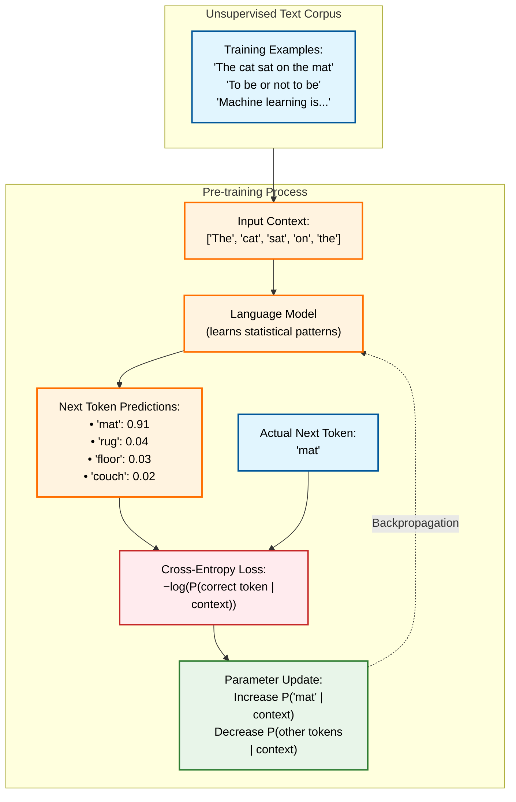
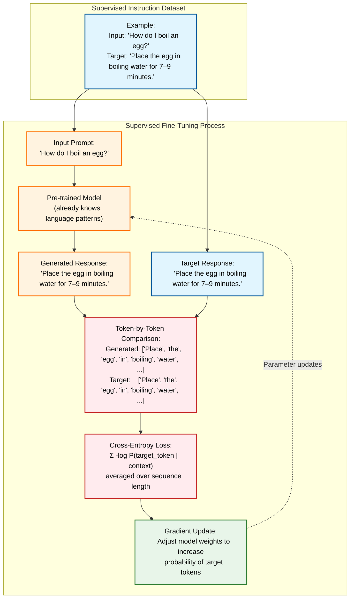
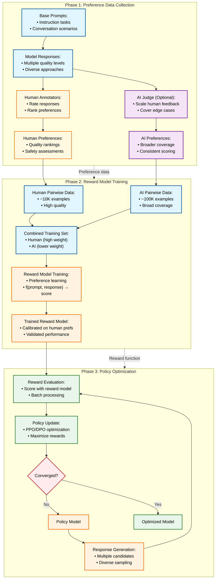
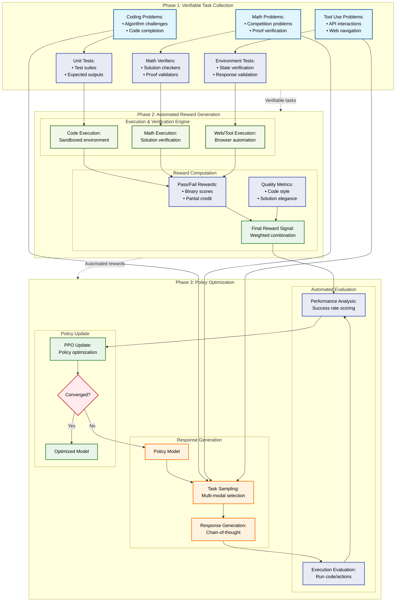

I had intended to start this post by proclaiming _"2026 will be the year of reinforcement learning"_ as 2025 is "the year of agents"... But model and research releases over the past several weeks indicate that it might be that "H2 2025" is when reinforcement learning for agentic AI really takes off. Open model releases such as Qwen3 (particularly the recent Qwen3 0725 updates), Kimi K2, GLM-4.5, gold-level performance from OpenAI and Google at the International Math Olympiad, and a corresponding rapid increase in reinforcement learning algorithm research and refinement indicate that the focus of the industry has shifted from scaling raw data and compute to scaling post-training with reinforcement learning (RL).

This hypothesis seems to be further validated by OpenAI's GPT-5 release. GPT-5 is cheaper than GPT-4o while retaining the same inference speed (tokens/second or end-to-end latency), and massively cheaper and faster than GPT-4.5, Claude 4 Opus, or Grok 4, which are known to be among the largest models. This low cost and fast response indicate that GPT-5 is likely not much larger than GPT-4o, indicating that generative AI capabilities can continue to increase (presumably due to better training methods and more training time) without significantly scaling model sizes.[^gpt5]

Barring new architectures or architectural refinement, scaling mid-and post-training with Reinforcement Learning approaches is the most effective way to increase the performance of a base language model. In fact, we may be at the point where scaling base model sizes and pretraining data is unnecessary (or even suboptimal) when the compute and training time could instead be used for reinforcement learning to help the model more effectively use the linguistic and world knowledge it gained during pretraining.

## What is reinforcement learning?

Reinforcement learning (RL) is a process that allows an algorithm to continue learning _without explicit examples_. Supervised learning tasks (such as classification or prediction), on the other hand, require sets of input-output pairs that teach the model to generate the output based on the input, RL teaches the model to maximize the reward it receives for actions it takes in response to arbitrary inputs. Importantly, this means that RL requires a separate reward function or reward model that can determine the appropriate reward (and reward intensity) for any action the model may take.[^wiki]

I really like Nathan Lambert's explanation of the _elicitation interpretation_ of post-training: The model is not _"learning entirely new abilities but rather learning to reinforce behaviors that were already latent in the pretraining dataset."_ Post-training teaches the model to better leverage patterns that exist in its pre-trained weights; because the model is not learning "new" information per se, elicitive post-training requires far less data (far fewer examples) to dramatically improve performance than pretraining or naive supervised fine-tuning.[^elicitation]

## Training language models

Language models leverage both supervised and reinforcement learning approaches at different points during their training phase.

### Pre-training

A base model is trained on enormous amounts of text using a self-supervised approach. The process is self-supervised because the text corpus itself provides the training examples and the ground truth answer. During pre-training, the model tries to predict the next ~~word~~ token in a sentence or paragraph ("The cat in \_\_\_", "The cat in the \_\_\_", "The cat in the hat \_\_\_"). It does so by predicting the probability of _all_ tokens, and then receives feedback about the correct answer, allowing it to update its internal weights to make the correct answer more probable.

By the end of pre-training, the model has internalized how language "works" through recognition of complex statistical patterns. It is capable of continuing an initial "seed" phrase with fluent grammar and logical and syntactic consistency at the sentence and paragraph level. Because the training data encompassed broad, undirected swaths of text-encoded human knowledge, the model is implicitly familiar with general facts about the world that are consistent across its training data. Depending on the data mixture used in pre-training, the model may also exhibit some initial ability to follow instructions or continue patterns.

 

Expand to view next-token prediction process diagram

### Mid-training

Mid-training may involve _context extension_, _language extension_, and/or _domain extension_, enabling the pre-trained model to be able to comprehend and work with longer contexts, to understand and reply in different languages, and/or to integrate _knowledge_ from high-quality datasets rather than simply produce coherent output, respectively. These tasks are often done as "continued pretraining," continuing the next-token prediction task but with a more curated dataset and to further a more specific model capability.

Mid-training is also likely to include instruction-following training, typically implemented as supervised fine-tuning (SFT) where the idea is to refine the model's predictions by showing it many examples of how we want it to respond. Like continued pretraining, the supervised fine-tuning process provides feedback after the model generates each token; however, instead of teaching the model to predict the next best token, SFT teaches the model to string together next-best tokens such that they form a desired response.

Regardless of which paradigm is used (continued-pretraining or SFT), the signal in mid-training is still _at the per-token granularity_.

 

Expand to view instruction tuning (SFT) process diagram

The distinction between pre-training, mid-training, and post-training is fuzzy; I listened to a podcast where the definition of mid-training was "not pre-training and not post-training" (_A/N: sorry, I can't find the reference_). I think of mid-training as "adding utility" but not the final polish; capabilities introduced in mid-training, such as instruction-following and long-context understanding, are often required in post-training.

### Post-training

I find it easiest to think about the distinction between mid- and post-training in terms of the granularity for how the model gets signal during training: _Post-training focuses on assessing the full model response in its entirety; pre- and mid-training focus on next-token accuracy._ Caveat: this distinction is not strictly true because supervised fine-tuning (SFT) is also frequently done in post-training.

Post-training focuses the model on being able to complete tasks in alignment with human expectations. Various reinforcement learning (RL) techniques are used (RLHF - RL with Human Feedback, RLVR - RL with Verifiable Rewards) that assess the full model response rather than simply determining whether the next-token-prediction is correct.

#### Reinforcement Learning with Human Feedback (RLHF)

In RLHF, a reward model (often branched from the mid-trained model artifact) is trained to mimic the preferences of human annotators. Then, the reward model is used to grade full responses from the model and teach the model which responses are _aligned_ with human preferences. This makes RLHF a powerful tool for teaching the model subjective "I know it when I see it" preferences, such as style, character, or safety.

> We first collect a dataset of human-written demonstrations on prompts submitted to our API, and use this to train our supervised learning baselines. Next, we collect a dataset of human-labeled comparisons between two model outputs on a larger set of API prompts. We then train a reward model (RM) on this dataset to predict which output our labelers would prefer. Finally, we use this RM as a reward function and fine-tune our GPT‑3 policy to maximize this reward using the PPO algorithm⁠.
> [Aligning language models to follow instructions | OpenAI](https://openai.com/index/instruction-following/) 27 Jan 2022

 

Expand to view Reinforcement Learning with Human Feedback (RLHF) process diagram

#### Reinforcement Learning with Verifiable Rewards (RLVR)

In contrast to RLHF, RLVR _does not need human annotation or alignment_. Instead, it provides reward signals based on response correctness; this works best on domains with verifiably-correct answers, such as mathematics, code, or when rubrics can be used to unambiguously provide a pass/fail signal, such as for instruction-following precision. This makes RLVR useful for task-oriented training.

 

Expand to view Reinforcement Learning with Verifiable Rewards (RLVR) process diagram

## RL for Agents

As we've established, reinforcement learning operates on the entire response of the model. During post-training, this frequently still operates on single-turn responses from a simple call-and-response paradigm - given a user request, we reward the model based on whether its response was deemed good or bad. However, there is no reason that we cannot extend this application of RL to agentic trajectories to improve AI Agents.

An AI Agent is an LLM using tools in a loop to accomplish a task; a trajectory is the record of the steps taken (tools used) by the LLM-powered Agent to accomplish the task. Just as we can use RL to assess whether a single-turn response was good or bad, we can use RL to assess whether the result of an Agent was good or bad; this process teaches LLMs to optimize their trajectories and improve their outputs over longer-running, complex tasks. Recent "Deep Research" Agents are powered by reasoning models that leverage agentic RL.[^kimi-researcher]

Because different Agents may have access to different tools, it is likely that fine-tuning with reinforcement learning will improve performance on specific tasks with a specific toolbox. RL fine-tuning can also make smaller models much more effective at specific tasks, and because RL tends to be more sample efficient than SFT, the fine-tuning procedure has less of a cold-start burden of developing the fine-tuning dataset.

The downside of agentic RL is the speed of training iteration and increased costs. Because the signal is only provided at the end of the agentic trajectory, it can take significant portions of an hour before a response can be evaluated, incurring high inference cost per cycle. The tools used by the agent may also cost money (e.g., an external web search API that charges by search), further increasing cost.[^kimi-researcher]

## RL fine-tuning is getting easier

The 2025 year of Agents has highlighted both how powerful AI Agents are when they are able to effectively use their tools and how frustrating they can be to debug or direct. As a result, the industry has been rapidly developing tools for RL fine-tuning to improve Agentic capabilities:

- HuggingFace [TRL (Transformer Reinforcement Learning)](https://huggingface.co/docs/trl/index) provides a toolkit for post-training (SFT and RL) that integrates with the `transformers` library.
- OpenPipe's [ART Trainer](https://openpipe.ai/blog/art-trainer-a-new-rl-trainer-for-agents) provides multi-turn support for RL fine-tuning AI Agents on their trajectories, and uses OpenPipe's [RULER (Relative Universal LLM-Elicited Rewards)](https://openpipe.ai/blog/ruler) reward model, a generalizable LLM-as-a-judge approach that ranks trajectories based on their success and efficiency.
- Microsoft's new [agent-lightning](https://www.microsoft.com/en-us/research/project/agent-lightning/) provides similar capabilities to OpenPipe ART using ByteDance's [verl](https://github.com/volcengine/verl) under the hood. Agent Lightning conceptualizes agent execution as a Markov decision process, with decisions modeled as structured transitions (states, actions, rewards). This allows assigning partial credit to various steps in the overall agent trajectory to optimize tool selection and intermediate outcomes that lead to higher overall success rates.

## 2026 is the year for RL fine-tuning

If 2025 was the year of Agents, 2026 will be the year to tune them. RL fine-tuning lets small, fast models achieve high success rates by applying RL techniques to agentic trajectories. It requires far less data than existing supervised fine-tuning methods and is enabled by a burgeoning ecosystem of open-source RL training frameworks. While not AGI, RL fine-tuning will massively increase the utility of AI agents over longer trajectories by making them more reliable. Today, a generic Agent can approach a 100% success rate on tasks that take humans ~5 minutes.[^metr] Agents refined by RL fine-tuning on specific tasks will extend that time horizon considerably further, moving Agents from "almost right but not quite" to trusted collaborators.

## Further Reading

- Sebastian Raschka's series on LLM training
  - [LLM Training: RLHF and Its Alternatives](https://magazine.sebastianraschka.com/p/llm-training-rlhf-and-its-alternatives)
  - Sidebar: [why do we need RLHF](https://magazine.sebastianraschka.com/i/106859367/do-we-need-rlhf) - explores why RLHF (really, RL) outperforms supervised learning (i.e., just scoring the expected vs predicted full sequences)
  - [Instruction Pretraining LLMs](https://magazine.sebastianraschka.com/p/instruction-pretraining-llms)
  - [New LLM Pre-training and Post-training Paradigms](https://magazine.sebastianraschka.com/p/new-llm-pre-training-and-post-training)
  - [The State of Reinforcement Learning for LLM Reasoning](https://magazine.sebastianraschka.com/p/the-state-of-llm-reasoning-model-training)
- Nathan Lambert's [RLHF Book](https://rlhfbook.com/)
- Caveat: [Reward Hacking in Reinforcement Learning](https://lilianweng.github.io/posts/2024-11-28-reward-hacking/)

## Reference

[^gpt5]: [Thread by @EpochAIResearch on Thread Reader App – Thread Reader App](https://threadreaderapp.com/thread/1953883611389702169.html)

[^wiki]: [Reinforcement learning](https://en.wikipedia.org/wiki/Reinforcement_learning)

[^elicitation]: [Elicitation, the simplest way to understand post-training](https://www.interconnects.ai/p/elicitation-theory-of-post-training)

[^kimi-researcher]: [Kimi-Researcher: End-to-End RL Training for Emerging Agentic Capabilities](https://moonshotai.github.io/Kimi-Researcher/)

[^metr]: [Measuring AI Ability to Complete Long Tasks - METR](https://metr.org/blog/2025-03-19-measuring-ai-ability-to-complete-long-tasks/)
