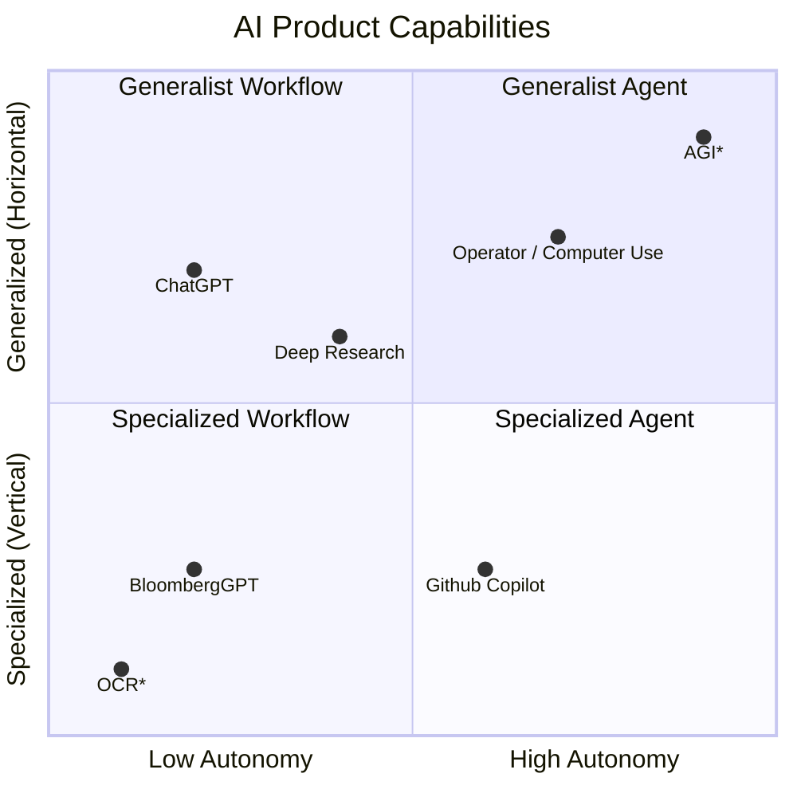

The Bitter Lesson proposes that general-purpose solutions based on the pace of technological progress and scale ineveitably outperform previously state-of-the-art but handcrafted solutions.
In many cases, the Bitter Lesson might be considered optimistic - technological progress drives a positive feedback loop of improvement.
What is left unsaid in that optimism is the pessimistic implication -- as AI continues to improve, it will inevitably overwhelm existing products, applications, roles, and jobs.

## The Bitter Lesson

The Bitter Lesson[^bitterlesson] is the eponymous (autonymous?) concept proposed by Richard Sutton, a Canadian computer scientist considered to be one of the founders of Reinforcement Learning,
where he notes that "general methods that leverage computation are ultimately the most effective, and by a large margin":

> The bitter lesson is based on the historical observations that 1) AI researchers have often tried to build knowledge into their agents, 2) this always helps in the short term,
> and is personally satisfying to the researcher, but 3) in the long run it plateaus and even inhibits further progress, and 4) breakthrough progress eventually arrives by an opposing approach based on scaling computation by search and learning.
> ...
>
> One thing that should be learned from the bitter lesson is the great power of general purpose methods, of methods that continue to scale with increased computation even as the available computation becomes very great.
> The two methods that seem to scale arbitrarily in this way are search and learning.[^bitterlesson]

Secondly, the Bitter Lesson stems from attempts to manually codify complex systems. Sutton notes:

> They are not what should be built in, as their complexity is endless; instead we should build in only the meta-methods that can find and capture this arbitrary complexity...
> Essential to these methods is that they can find good approximations, but the search for them should be by our methods, not by us.
> We want AI agents that can discover like we can, not which contain what we have discovered. **Building in our discoveries only makes it harder to see how the discovering process can be done.**[^bitterlesson] (emphasis mine)

Generally speaking, then, we can say that generalization outperforms specialization _when specialization is a hand-crafted (human-crafted), lossy heuristic for the task at hand_.

We can see the Bitter Lesson at play in the AI product market today. Finely-tuned custom solutions have been quickly surpassed by the general performance of newer models.
Bloomberg famously fine-tuned `BloombergGPT`, a LLM focused on natural language tasks specifically for the finance industry, on a corpus that included Bloomberg's proprietary financial data.
It was outperformed by `GPT-4` on those same financial tasks a mere 6 months later[^bloomberggpt] [^bloomberggpt_fallout] [^financial_gpt].
OpenAI recently shared a bitter lesson learned themselves -- in 2024, they created a special version of its then state-of-the-art `o1` model, `o1-ioi`, to compete in International Olympiad in Informatics (IOI).
Using hand-crafted strategies, they placed in the middle of the pack (49th percentile).
An early checkpoint of OpenAI's next-generation, general-purpose `o3` model "surpasses those results without relying on hand-crafted inference heuristics."[^o1_olympiad]
Their conclusion could be mistaken for a quote from Sutton's essay:

> "Overall, these results indicate that scaling general-purpose reinforcement learning, rather than relying on domain-specific techniques,
> offers a robust path toward state-of-the-art AI in reasoning domains, such as competitive programming." [^o1_olympiad]

 
<!-- NOTE: the height must >= height in the json file or the iframe will overlap the below content -->


## Susceptibility to the Bitter Lesson

Building new state-of-the-art foundation models or the datacenter infrastructure on which to run them requires financing out of the reach of most startups.
Therefore, most startups in the AI space are building systems on top of foundation models.
They might do this by fine-tuning a model to do better at a particular task, by adding a curated set knowledge to the model so it knows about it as it responds,
or by building "agentic" software systems around the model that allow it to act on the user's behalf.

> [!NOTE]
>
> The AI industry expects 2025 to be [the year of Agentic AI](https://finance.yahoo.com/news/nvidia-jensen-huang-says-ai-044815659.html).
> Exact definitions for what an AI "Agent" is are still debated.
> My opinion (aligned with [Anthropic's definition](https://www.anthropic.com/research/building-effective-agents)) is that `agentic AI` is where the system acts on behalf of the user.
> In this sense, `agentic` can take the form of `workflows` composed of predetermined steps (typically curated by people),
> and `agents` are more dynamic systems where the AI system itself determines how to proceed to accomplish a given task.

In any of these cases, the startup alters the base AI model by making it better at specific things, by making it more autonomous, or both. And currently, the approach to customizing AI models takes a lot of engineering effort.
Lukas Petersson wrote [a series of blog posts](https://lukaspetersson.com/blog/2025/bitter-vertical/) applying the Bitter Lesson to AI products, where he conceptualizes a quadrant map defining these product capabilities:

<figure class="hx-flex hx-w-full hx-flex-col hx-items-center">
  

  
  <figcaption>
    AGI: Artificial General Intelligence  
    OCR: Optical Character Recognition  
  </figcaption>
</figure>

The columns in this plot represent `autonomy`, or how independently the AI can operate.
`Workflows` are systems where LLMs and tools follow _predefined code paths_, while `Agents` are systems that control their own processes and tool usage, deciding how to complete tasks.
The rows in this plot represent `specificity`, or how focused a solution is.
A `vertical` solution is a specialist designed for one specific problem, while a `horizontal` product is a generalist that can handle many different types of problems.[^bl_ch1]

Petersson notes "Building software to compensate for current model limitations seems like fighting a losing battle, especially given how rapidly models are advancing." [^bl_ch1]
Vertical AI is easy to recognize, as it is what most startups in the AI application layer build today... they achieve more reliability by constraining the AI in predefined workflows."
After a market analysis with Hamilton Helmer's 7 Powers, Petersson concludes that the strongest moat for a specialist product (especially for a startup) is a _cornered resource_, though the conditions for success are stringent:
"The resource has to be truly exclusive—that is, it should not be available for sale at any price. It also has to be truly required to operate in that vertical, meaning without it, your product cannot succeed regardless of other factors"[^bl_ch2]

> [!NOTE]
>
> [Hamilton Helmer's 7 Powers](https://7powers.com/) is a framework for analyzing competitive advantage.[^7_powers] [^moat] The powers are:
>
> 1. **Scale economies** - unit costs are amortized over volume
> 2. **Network economies** - customer value increases as customer base increase
> 3. **Counter-positioning** - a business model that cannot be mimicked by competitors
> 4. **Switching costs** - switching loses a customer more than it gains them
> 5. **Branding** - brand recognition increases perceived value of product
> 6. **Cornered Resource** - preferential or exclusive access to an otherwise constrained/limited resource
> 7. **Process Power** - business processes (such as manufacturing) that lead to lower costs and/or superior products

He concludes that it is not really a question of _whether_ startups in the AI space are doomed, but _when_ [^bl_ch3].
This is because startups are likely specialists as it is unlike they have the ability to generalize or scale like the foundation labs or big tech incumbents.

## YCombinator Spring 2025 Cohort

YCombinator (a famous startup accelerator and venture capital firm) recently put out its request for startups for its Spring 2025 (X2025) cohort.[^yc]
In a particularly interesting juxtoposition to Petersson's pessismism regarding the Bitter Lesson, YCombinator focuses particularly on _vertical_ ideas and _specialized_ applications.
A common thread running through the concepts they believe to be "worth working on" are `vertical AI agents`, where a (software) product is built on top of LLMs to be able to automate some kind of real, important work. YC say,
"Building systems like this that work in real-world conditions requires real agentic architectures, integrations with legacy systems, and deep domain understanding."
Specifically, the hope is that entire job functions could be replaced with AI, targeting roles with significant repetitive tasks and high-value functions such as tax accounting, compliance auditing, medical billing, and software engineering,
freeing their human peers from the rote work to focus on more complex tasks and allowing "every human on the planet" to have a "personal AI staff" of expert tutors, doctors, trainers, accountants, etc.

The startup ideas shared by YCombinator _do_ have advantages over _current_ business (and labor markets), commonly relying on scale economies, counter positioning, and/or processing power to disrupt the current status quo.
However, as Petersson explored, they are likely succeptible to the continued scaling and generalization of AI.

## Near-term Optimism

Let's assume that YCombinator are right, and their goal (given they are venture capital) is to have startups succeed in the short term such that
(a) they become unicorns and the venture is worth it, or (b) the startup gets acquired and the venture doesn't lose money.
This doesn't mean that the startups are not susceptible to the bitter lesson!

An equivalent metaphor about might be how people search for jobs – some jobs require generalists and some specialists (horizontal and vertical product respectively).
In this metaphor, the challenge is that schools are improving such that the depth-of-ability of generalists is approaching the depth-of-ability of specialists, and the specialists aren't able to generalize as well.
The educational improvements occur on a generational basis ("we stand on the shoulders of giants").
While a current specialist is safe, an individual in graduate school intending to specialize may not be, and the individual in high school intending to get a PhD is not.

Given this, what should startups do? It seems to me the answer is to identify how they specialized, make that process repeatable, and then aggressively specialize on top of each generation's cutting-edge generalist models.
Referring back to our metaphor, a university that specializes in turning (generalist) students into world-renowned _insert specialization here_
will produce specialists that outperform of whatever generalists exist because the specialization occurs on top of the equivalent generalist base.
This hypothetical university's moat's defensibility is determined by how challenging it is to specialize in the area without the university's program, the separation between generalist and specialist performance created by the program,
and whether the formula for specialization can be scaled and maintained as best-in-class as the market changes.

This plays directly into the "cornered resource" competitive advantage.
If a startup is the best in the world at taking current-gen general models and improving their performance on in-domain tasks, they will be hard to beat, presuming it does not take them long to play catchup once a new model generation is released.

Further, it may be the case that general models are simply not good enough for certain tasks.
We must acknowledge that there is error in the data that that foundation models are trained on (otherwise they would be omniscient).
As a result a general model may be incapable of the precision or accuracy a task may require, and these tasks provide viable opportunity for specialization.
But specialization may follow a power-law or pareto principle for cost/outcome;
if a general model takes the 20% effort to do 80% of the work, the specialized model may require 80% additional cost or effort, which is likely too expensive for most business models.

## AI Optimism is Humanistic Pessimism

If we assume the Bitter Lesson to be true, it begs the longer-term question about whether AI will absolve the need for human employment.
OpenAI have [given their AI system the ability to run code, look up information, and use external tools](https://platform.openai.com/docs/assistants/overview) (web search, integrate with other APIs).
OpenAI and Anthropic have provided the ability to interact with the computer applications and websites through UI designed for humans.
"Reasoning" models have the ability to process more complex concepts, backtrack, and self-correct.

I don't know about you, but typing, searching, reading documentation, and coding cover a broad portion of my day-to-day tasks.
The parts that are not covered - the meetings, the tactical and strategic thinking, etc., are elements for which I understand there are also AI systems being developed.
Even if the systems are not capable of human-level performance _yet_, the Bitter Lesson implies _they will be_.
With YCombinator looking for startups to complete tasks or replace job functions, it is not a huge step to imagine AI Agents that replace entire job roles or career paths.

I do truly believe this is ultimately what people like Sam Altman mean when they talk about "Artificial General Intelligence."
In 2016, Altman announced research on Universal Basic Income, saying
"I'm fairly confident that at some point in the future, as technology continues to eliminate traditional jobs and massive new wealth gets created, we're going to see some version of this at a national scale." [^ubi]
Even outside the risk of [singularity](https://en.wikipedia.org/wiki/Technological_singularity), the future predicted by the Bitter Lesson is radically different from the society of today.

## References

[^bitterlesson]: [The Bitter Lesson](http://www.incompleteideas.net/IncIdeas/BitterLesson.html)

[^bloomberggpt]: [Introducing BloombergGPT, Bloomberg's 50-billion parameter large language model, purpose-built from scratch for finance | Press | Bloomberg LP](https://www.bloomberg.com/company/press/bloomberggpt-50-billion-parameter-llm-tuned-finance/)

[^bloomberggpt_fallout]: [Bloomberg spent over $10M training AI on their own financial data last year... only to find that GPT-4 beat it on almost all finance tasks!](https://www.threads.net/@ethan_mollick/post/C46AfItO8RS)

[^financial_gpt]: [[2305.05862] Are ChatGPT and GPT-4 General-Purpose Solvers for Financial Text Analytics? A Study on Several Typical Tasks](https://arxiv.org/abs/2305.05862)

[^o1_olympiad]: [[2502.06807] Competitive Programming with Large Reasoning Models](https://arxiv.org/abs/2502.06807)

[^bl_ch1]: [AI Founder's Bitter Lesson. Chapter 1 - History Repeats Itself | Lukas Petersson's blog](https://lukaspetersson.com/blog/2025/bitter-vertical/)

[^bl_ch2]: [AI Founder's Bitter Lesson. Chapter 2 - No Power | Lukas Petersson's blog](https://lukaspetersson.com/blog/2025/power-vertical/)

[^7_powers]: [7 Powers: The Foundations of Business Strategy by Hamilton Helmer – The Rabbit Hole](https://blas.com/7-powers/)

[^moat]: [Building your strategic moat – a review of 7 Powers by Hamilton Helmer](https://productstrategy.co/7-powers-hamilton-helmer/)

[^bl_ch3]: [AI Founder's Bitter Lesson. Chapter 3 - A Footnote in History | Lukas Petersson's blog](https://lukaspetersson.com/blog/2025/footnote-vertical/)

[^yc]: [Requests for Startups | Y Combinator](https://www.ycombinator.com/rfs)

[^ubi]: [Basic Income | Y Combinator](https://www.ycombinator.com/blog/basic-income)
